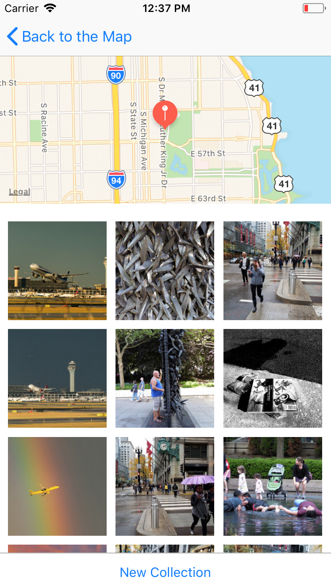

* Universal iOS app that lets you see and save photos of places around the world
* Utilized MapKit and Flickr API, as well as CoreData framework for data persistence
* Locations and images are stored using Core Data
* Images are displayed in a CollectionView

